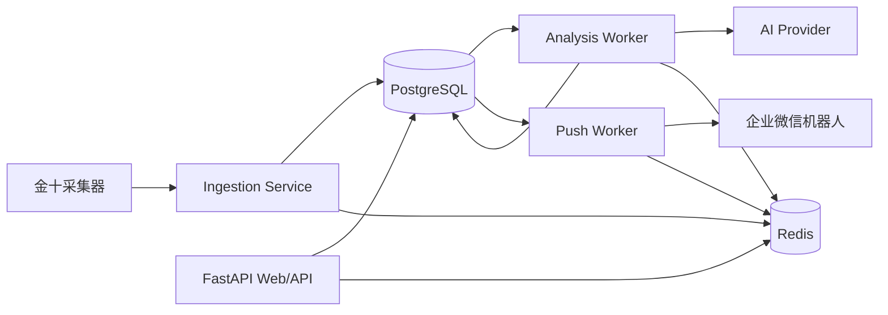

# AI 财经微信助手 V1 架构设计

状态：Milestone 0（设计阶段，待确认）  
版本：v0.1  
日期：2026-08-08

## 1. 目标与边界

V1 形成可持续运行的闭环：金十数据采集 -> PostgreSQL 持久化 -> AI 分析/去重/评分/摘要 -> 企业微信机器人推送 -> Web 后台查询。

V1 不实现持仓、问答、RAG、日报/周报、多推送渠道和多数据源适配器，但在接口和数据模型上预留扩展点。

非功能目标：可恢复（任务失败可重试且不重复推送）、可观测（结构化日志和运行状态）、可配置（环境变量）、可部署（Docker Compose）、可测试（单元测试为主，关键链路集成测试）。

## 2. 总体架构



部署单元：`api`（FastAPI）、`worker`（统一任务进程，按队列消费不同任务）、`scheduler`（定时触发采集/重试）、`postgres`、`redis`。V1 可将 scheduler 合并进 worker，但保留独立进程边界，便于后续水平扩展。

### 2.1 处理链路

1. 采集器以游标/时间窗口拉取金十数据，标准化为 `NewsItem`，按来源外部 ID 或规范化内容哈希幂等写入。
2. 新文章创建 `analysis_status=pending`，投递 `analyze_news` 任务。
3. 分析 worker 调用统一 `AIProvider`：结构化输出分类、市场、重要性（1-5）、摘要、去重候选和置信度；结果写入版本化 `news_analyses`。
4. 去重采用两层策略：数据库唯一约束/内容哈希去硬重复，AI 对候选集做语义归并；保留原文，使用 `canonical_news_id` 指向主新闻。
5. 满足推送策略的分析结果创建唯一 `push_deliveries` 记录并投递 `push_news`，企业微信返回成功后记录响应和时间。
6. 所有任务采用有限次指数退避重试；超过次数进入 dead-letter 状态，后台可查询并人工重试。

## 3. 模块与职责

```text
src/app/
  main.py                 # FastAPI 入口、生命周期
  config.py               # Pydantic Settings，唯一配置入口
  logging.py              # JSON 日志、request/task correlation id
  db/
    models.py             # SQLAlchemy ORM
    session.py            # engine/session/事务
    migrations/           # Alembic
  domain/
    news.py               # 新闻、分析、推送领域类型和状态机
    policies.py           # 评分阈值、推送策略
  ingestion/
    base.py               # NewsSource 抽象接口
    jina10.py             # 金十数据适配器（仅适配器，不污染领域模型）
    service.py            # 拉取、标准化、幂等入库
  analysis/
    provider.py           # AIProvider 协议及结构化响应类型
    service.py            # 分析编排、版本、重试和降级
    prompts.py            # 提示词模板和版本
  delivery/
    base.py               # Notifier 抽象接口
    wecom.py              # 企业微信机器人
    service.py            # 推送策略、幂等、结果记录
  jobs/
    queue.py              # Redis 队列封装
    tasks.py              # analyze/push/collect/retry 任务
    scheduler.py          # 周期触发器
  api/
    routes_news.py        # 新闻列表、详情、重试
    routes_analysis.py    # 分析查询
    routes_deliveries.py  # 推送日志、重试
    routes_system.py      # 健康检查、运行状态
  schemas/                # API 请求/响应 DTO
tests/
  unit/ integration/
```

依赖方向：`api/jobs` -> application services -> domain ports；适配器（金十、AI、企业微信、Redis）只实现 ports。领域层不依赖 FastAPI、Redis 或具体模型厂商。

## 4. 数据库设计（PostgreSQL）

### `news_items`

`id UUID PK`, `source VARCHAR(32)`, `source_item_id VARCHAR(128)`, `title TEXT`, `content TEXT`, `url TEXT`, `published_at TIMESTAMPTZ`, `collected_at TIMESTAMPTZ`, `content_hash CHAR(64)`, `canonical_news_id UUID NULL FK news_items(id)`, `ingestion_status`, `analysis_status`, `created_at`, `updated_at`。

唯一约束：`(source, source_item_id)`（若来源无稳定 ID，则由 `source + content_hash` 兜底）。索引：`published_at DESC`、`analysis_status`、`canonical_news_id`。

### `news_analyses`

`id UUID PK`, `news_id UUID FK`, `provider VARCHAR(64)`, `model VARCHAR(128)`, `prompt_version VARCHAR(32)`, `category VARCHAR(32)`, `markets JSONB`, `importance SMALLINT CHECK 1..5`, `summary TEXT`, `impact TEXT`, `keywords JSONB`, `confidence NUMERIC(4,3)`, `dedup_group_key VARCHAR(128) NULL`, `raw_response JSONB`, `created_at`。

同一新闻可保存多版本分析；查询默认使用最新成功版本。索引：`news_id, created_at DESC`、`importance`、`markets` GIN。

### `push_deliveries`

`id UUID PK`, `news_id UUID FK`, `analysis_id UUID FK`, `channel VARCHAR(32)`, `destination VARCHAR(128)`, `status`, `attempts`, `last_error TEXT NULL`, `provider_message_id TEXT NULL`, `requested_at`, `sent_at NULL`, `created_at`, `updated_at`。

唯一约束：`(analysis_id, channel, destination)`，保证重试不重复发送。状态：`pending|sending|sent|failed|dead_letter|skipped`。

### `job_runs`

记录采集、分析、推送任务的 `id`, `job_type`, `entity_id`, `status`, `attempt`, `started_at`, `finished_at`, `error_code`, `error_message`，用于后台状态和运维审计。

## 5. AI Provider 契约

```python
class AIProvider(Protocol):
    async def analyze_news(self, item: NewsForAnalysis) -> NewsAnalysisResult: ...
    async def find_duplicates(self, item: NewsForAnalysis, candidates: list[NewsForAnalysis]) -> DedupResult: ...
```

Provider 配置使用 `AI_BASE_URL`、`AI_API_KEY`、`AI_MODEL`，兼容 OpenAI Chat Completions/Responses 风格接口；调用必须要求 JSON Schema/结构化输出，校验失败进入可重试错误。模型、提示词和分析版本写入数据库，保证可追溯。V1 默认只实现 OpenAI-compatible adapter。

## 6. API 设计（V1）

前缀 `/api/v1`，JSON 响应，时间统一 ISO-8601 UTC。

| 方法 | 路径 | 用途 |
|---|---|---|
| GET | `/health` | 存活检查（不依赖外部服务） |
| GET | `/ready` | PostgreSQL/Redis 可用性检查 |
| GET | `/system/status` | 最近采集、队列积压、失败数、最后推送 |
| GET | `/news` | 分页查询，按时间/重要性/市场/分类/状态过滤 |
| GET | `/news/{id}` | 新闻、分析版本、推送记录详情 |
| POST | `/news/{id}/reanalyze` | 手动重新分析 |
| GET | `/deliveries` | 推送日志分页和状态过滤 |
| POST | `/deliveries/{id}/retry` | 手动重试死信/失败推送 |

V1 后台可先使用同一 FastAPI 提供的轻量 HTML/静态前端；API 与展示层保持分离，未来可替换独立前端。

## 7. 配置与安全

`.env` 只存本地运行配置，提交 `.env.example`，禁止密钥入库。核心配置：`DATABASE_URL`、`REDIS_URL`、`AI_BASE_URL`、`AI_API_KEY`、`AI_MODEL`、`WECOM_WEBHOOK_URL`、采集间隔、重试上限、推送最低星级、时区。

Webhook、API 密钥在日志中脱敏；后台 V1 默认绑定内网，可选 `ADMIN_TOKEN` Bearer 保护写操作。数据库采用最小权限用户，容器不以 root 运行（基础镜像支持时）。

## 8. 可观测性与可靠性

结构化日志字段：`timestamp`, `level`, `service`, `event`, `task_id`, `news_id`, `attempt`, `duration_ms`, `error`。`/system/status` 从 `job_runs` 和 Redis 统计派生。任务使用 Redis 队列的显式 ack、幂等键和退避；数据库迁移由 Alembic 管理。外部 AI/微信调用设置连接和总超时，禁止无限等待。

## 9. 测试策略

单元测试覆盖标准化、哈希幂等、状态迁移、AI JSON 校验、推送格式/策略和重试退避；集成测试使用 Docker PostgreSQL/Redis，验证一条新闻从入库到推送记录的完整链路；适配器测试使用 HTTP mock，不调用真实 AI/微信。CI 阶段执行 `ruff`、`mypy`、`pytest`。

## 10. Milestone 计划

| Milestone | 交付物 | 验收标准 |
|---|---|---|
| M0 设计（当前） | 本文档、目录/API/数据库/扩展设计 | 用户确认设计 |
| M1 初始化 | Python 项目、配置、日志、Alembic、Compose 骨架 | 服务可启动，健康检查通过 |
| M2 数据库 | ORM、迁移、仓储和测试 | CRUD、约束、迁移可重复执行 |
| M3 采集 | 金十适配器、采集任务 | 定时采集、幂等入库、失败重试 |
| M4 AI 分析 | Provider、结构化分析、去重/评分/摘要 | mock AI 下分析结果可追溯 |
| M5 推送 | 企业微信 adapter、策略、日志 | 成功/失败/重试且不重复推送 |
| M6 Web 后台 | 新闻、分析、推送、状态页面 | 可筛选查看并手动重试 |
| M7 部署与验收 | Docker Compose、文档、集成测试 | 一键启动，跑通端到端闭环 |

每个 Milestone 完成后暂停，提交变更摘要、测试结果和已知风险，等待确认后进入下一阶段。

## 11. 关键设计决策与风险

- 金十数据的公开接口、字段和授权可能变化；采集器必须隔离、可配置，并记录原始响应摘要，必要时后续增加官方/合规来源。
- AI 输出不应直接驱动交易；系统只做信息筛选与解释，后台需保留原文和模型版本。
- 企业微信机器人有频率/消息长度限制；推送服务需截断摘要、限流并记录响应。
- Redis 队列不是永久事实来源；任务状态和业务结果以 PostgreSQL 为准，Redis 仅负责调度。
- V1 单 worker 可运行，后续按任务类型拆分和水平扩展，无需改变领域接口。

## 12. Event 聚合与新闻关系

`Event` 是业务中心对象，表示一个市场事件（例如“美国 CPI 公布”）；`NewsItem` 是该事件的一条来源报道。一个 Event 可关联多条 NewsItem，分析、推送和历史查询默认以 Event 为中心。

`events` 表：`id`, `title`, `event_type`, `event_key`, `occurred_at`, `status`, `importance`, `markets JSONB`, `summary`, `manual_override JSONB`, `created_at`, `updated_at`。`news_items.event_id` 为外键。`event_key` 支持应用层并发幂等，但不替代内容去重。

Event 去重分为：时间窗口候选（同市场、同类型的发布时间附近）、实体与关键词提取、标题/正文向量相似度、AI 最终判断。所有匹配和拒绝结果记录在 `event_merge_decisions`，并通过 `manual_override` 允许后台人工合并/拆分。

## 13. Prompt、Provider 和采集源插件

`prompt_versions` 表保存 `prompt_name`, `version`, `prompt_content`, `enabled`, `created_at`，并对 `(prompt_name, version)` 施加唯一约束。`news_analyses.prompt_version_id` 引用它；禁止将活动 Prompt 文本直接写入业务代码。后台可查看实际 Prompt 和切换 enabled 版本。

Provider 、News Source 和 Push Channel 均采用注册表：接口只依赖抽象合同，启动时通过注册器发现实现。增加 DeepSeek/Qwen/CLSCrawler/Telegram 等只需新增插件和配置，不修改分析或推送编排。

## 14. 分析状态、调试与成本

Event 状态：`pending -> analyzing -> succeeded -> push_pending -> pushed -> archived`；任何中间态均可进入 `failed` 并按策略重试，超过上限进入 dead-letter。状态转移在事务中完成并写入 `job_runs`。

`ai_usages` 表记录 `analysis_id`, `provider`, `model`, `prompt_tokens`, `completion_tokens`, `total_tokens`, `cost`, `duration_ms`, `created_at`，不强绑任何厂商的计费单位。`news_analyses` 保留脱敏后的原始输出、响应时间和模型名，供 Prompt 调试。

Dashboard 按日期从 PostgreSQL 和 Redis 汇总：新闻数、AI 成功率、推送数、平均耗时、Provider 错误率、队列长度和 PostgreSQL 连接状态。

## 15. M3 采集框架补充

采集链路固定为 `SourceAdapter -> Fetcher -> RawNews -> Normalizer -> EventMatcher -> NewsRepository`。`RawNews` 保存第三方完整响应（`raw_json`、`headers`、`received_at`、`content_hash`、`fetch_version`），`NewsItem` 只保存标准化结果；两者通过来源和外部 ID 关联逻辑保持可追溯。

`SourceCursor` 按 source 唯一保存 `last_id`、`last_time` 和扩展 `cursor_data`，采集成功后才提交游标，支持断点续采。Redis 只承载统一 `Task`（`type`、`payload`、`retry_count`、`created_at`）序列化消息，不再依赖固定任务名。

采集开关 `ENABLE_CRAWLER`、`ENABLE_AI`、`ENABLE_PUSH` 进入 Settings；运行时覆盖项进入 `system_configs`，由 Repository 读取并由后台修改。所有人工修改写入 `audit_logs`，包含操作者、动作、实体和前后值。

Event 的 `importance` 是独立字段，推送策略以 Event 为单位；NewsItem 仅作为事件证据和来源版本。M3 首个适配器为 `Jin10Adapter`，URL 和字段映射保持可配置，后续新增来源不改变 Fetcher、Normalizer、Matcher 或 Repository。

## 16. M4 AI Pipeline

AI 分析严格经过 `ContextBuilder -> PromptBuilder -> ProviderRouter -> ResponseValidator -> AnalysisResultRepository`。PromptBuilder 同时携带 System Prompt、Task Prompt、JSON Output Schema、Few-shot Examples 和数据库中的 PromptVersion；ContextBuilder 只拼接 Event、当前 NewsItem、相关新闻和历史分析，RAG 作为未来可插入的上下文来源。

ProviderRegistry 负责插件注册，ProviderRouter 负责选择默认或指定 Provider；V1 提供 OpenAI-compatible adapter。Validator 使用 Pydantic 生成/校验 JSON Schema，并检查星级、置信度、资产和方向枚举。失败结果只写入 `ai_review_queue`，不创建 `news_analyses`、`market_impacts` 或 `ai_usages`。

AI Cache 的 key 由 PromptVersion 与内容哈希共同生成；命中时复用结构化结果和 Provider 元数据。有效结果由 AnalysisResultRepository 在同一事务中写入 Analysis、MarketImpact 和 AIUsage，保存 Prompt 快照、RawResponse、Provider、Model、Token 和耗时。

## 17. M5 Notification Framework

通知链路固定为 `Event -> DecisionEngine -> Notification -> PushChannel -> PushDelivery`。DecisionEngine 根据 Event 重要性、用户偏好、静默时段和现有待发通知产出 `push|delay|merge|ignore`；任何渠道调用不得绕过决策层。

Notification 是通知意图和状态，PushDelivery 是一次渠道交付尝试，两者通过 `notification_id` 解耦。PushDelivery 的幂等键为 Notification、Channel、Destination；分析结果不再是必需外键，确保 Event 级通知成立。

MergeEngine 合并同一 Event、同一渠道的短时间待发通知，保留最高优先级和来源 Notification ID。22:30-07:30 静默期间，5 星 Event 立即发送，4 星及以下延迟至静默结束。

UserPreference 按用户保存 Markets、Assets、Categories、Minimum Importance 和静默时段。PushChannelRegistry 以插件方式注册企业微信及未来 Telegram、Email、飞书和 Webhook。所有创建、延迟、合并、取消、发送、失败和重试写入 `notification_timelines`。
